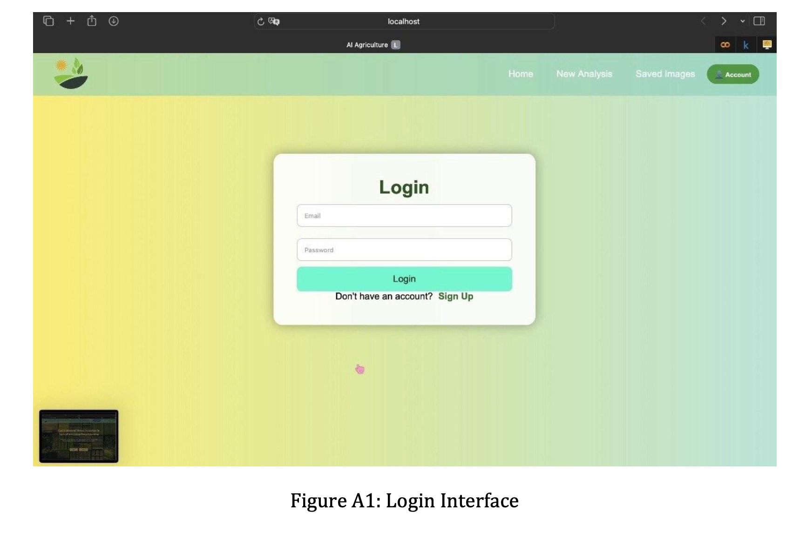
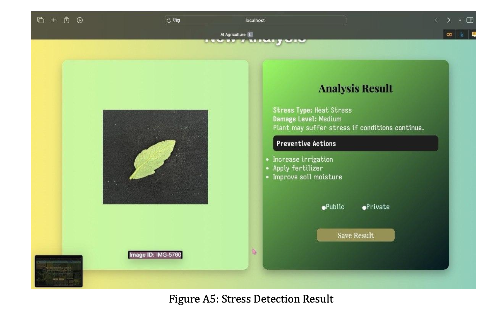
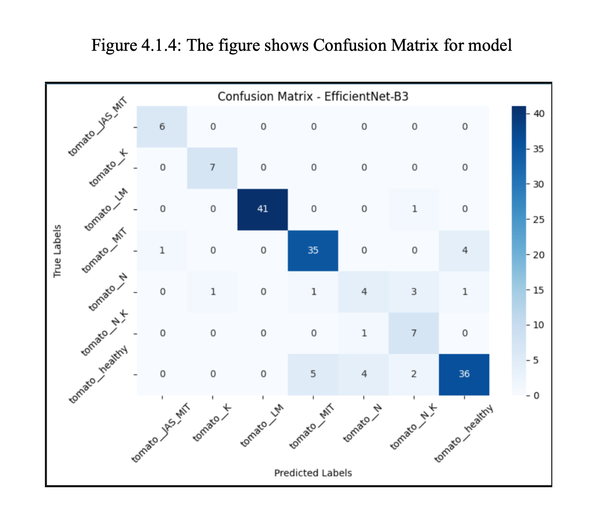

# 🌱 Environmental Stress Detection in Agriculture Using Deep Learning

An intelligent AI-powered agricultural platform that detects environmental stress in crops using Deep Learning and Computer Vision to support early intervention and sustainable farming.

---

# 📌 About The Project

This project was developed at King Khalid University, College of Computer Science.  
The system analyzes plant leaf images and predicts environmental stress conditions such as:

- Drought Stress
- Heat Stress
- Nutrient Deficiency
- Leaf Diseases
- Mites & Complex Stress

The goal is to help farmers detect crop problems early before severe damage appears.

---

# 🚀 Features

- Upload plant images
- AI-powered stress analysis
- Stress severity estimation
- Preventive action recommendations
- User authentication system
- Save analysis results
- Search saved images
- Generate PDF reports
- Public/Private report visibility

---

# 🧠 AI Model

The system uses:

- EfficientNet-B3
- PyTorch
- Computer Vision techniques

Model Accuracy:
- 86% – 88%

The model was mainly trained on tomato plant datasets.

--- 

# ⚠️ Current Limitations

- The current model was primarily trained on tomato plant datasets.
- Predictions on other plant species may produce inaccurate or overconfident results.
- Future improvements will focus on expanding datasets and improving model generalization across multiple crops.

---

# 📸 System Screenshots

## Login Page



---

## Analysis Result



---

## Model Confusion Matrix



---

# 🛠️ Technologies Used

## Frontend
- React.js
- HTML5
- CSS3
- JavaScript

## Backend
- Node.js
- Express.js
- REST API
- Multer

## Database
- MySQL

## AI & Machine Learning
- Python
- PyTorch
- TorchVision
- Pillow
- NumPy

---

# 📂 Project Structure

```bash
AI-AGRICULTURE-2/
│
├── public/
├── src/
│   ├── assets/
│   ├── components/
│   ├── pages/
│   ├── styles/
│   ├── App.jsx
│   └── main.jsx
│
├── server/
│   ├── ai/
│   │   ├── predict.py
│   │   └── best_efficientnet_b3_model.pth
│   │
│   ├── db/
│   │   └── DB.js
│   │
│   ├── routes/
│   │   ├── api.js
│   │   └── aiRoutes.js
│   │
│   ├── uploads/
│   └── index.js
│
├── docs/
│   └── Final_Report.pdf
│
├── .gitignore
├── README.md
```

---

# ⚙️ Installation

## Clone the repository

```bash
git clone https://github.com/YOUR_USERNAME/AI-AGRICULTURE-2.git
```

---

## Install frontend dependencies

```bash
npm install
```

---

## Install backend dependencies

```bash
cd server
npm install
```

---

## Install Python dependencies

```bash
pip install torch torchvision pillow numpy
```

---

# 🔐 Environment Variables

Create a `.env` file inside the server folder:

```env
DB_HOST=127.0.0.1
DB_USER=root
DB_PASSWORD=YOUR_PASSWORD
DB_NAME=StressAnalysis
DB_PORT=3306
PORT=3001
```

---

# ▶️ Running The Project

## Start Backend

```bash
cd server
node index.js
```

---

## Start Frontend

```bash
npm run dev
```

---

# 📊 System Workflow

1. User uploads plant image
2. Backend receives image
3. AI model analyzes stress
4. System predicts damage severity
5. Recommendations are generated
6. Results are saved in database
7. PDF report can be downloaded

---

# 📄 Project Documentation

Full academic report available here:

[View Final Report](./docs/Report.pdf)

---

# 📄 Academic Information

King Khalid University  
College of Computer Science

Supervisor:
Dr. Ali Algrawi

---

# 👨‍💻 Team Members

- Ghala Ali Al-Hasanaih
- Sara Abdullah Al-Mazni
- Reemas Al-Qahtani
- Sadeem Yahya Alamri
- Esra Hamza Al-Daher

---

# 🌍 Future Improvements

- Drone integration (UAVs)
- Mobile application
- Real-time monitoring
- Cloud deployment
- Multi-language support
- More plant datasets

---

# 📜 License

This project is for educational and research purposes only.


